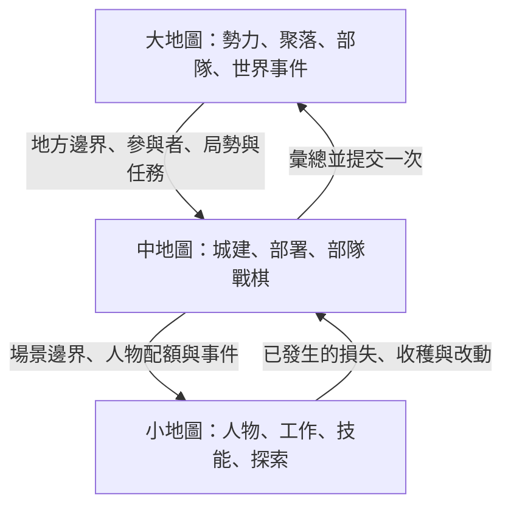

# 三層地圖藍圖

[本層入口](README.md)｜← [開發路線總覽](roadmap-2026-09.md)｜規則：[原則](../../../../design/principles.md)｜用詞：[術語表](../../../../design/glossary.md)

**使用者 2026-09-09 明定：aetheria 的宗旨就是大、中、小三層地圖。** 本稿回答每層負責什麼、參考哪裡、怎麼接成同一個世界。這次只寫文件。

## 大地圖：文明與世界

**主要參考 Endless Legend 的系統與架構。** 玩家看的是勢力、聚落、地理、資源、行軍、外交與世界事件；主要問題是「去哪裡、養得起什麼、要跟誰合作或交戰」。

規劃為五組責任：

- 世界生成與交通：地形、道路、資源、聚落位置、可達性與出生條件。
- 勢力與經濟：控制權、聚落收支、建設需求、研究或其他解鎖、部隊供養。
- 外交與戰爭：關係、條約、宣戰理由、戰果、厭戰與和談。
- 大局 AI：看自己的情報，提出目標，分配有限資源，下正式命令並追蹤結果。
- 世界歷史：文明與勢力加入、人物與地方狀態、跨層事件及內容版本。

借用 Endless 的命令入口、結算依賴、收支可追查、AI 目標與資源分配。**不直接複製一省一城、六角格、數值與終局政策。** 它的 Region 是省份；本案 `Region` 是一張大地圖，省份若有需要應是圖內的政治資料，而非新增地圖層。

來源：[Endless 通用藍圖](/home/lorkhan/repo/moddings/endless/wf/workflows/investigations/4x-design.md:5)、[AI](/home/lorkhan/repo/moddings/endless/wf/workflows/investigations/4x-ai.md:17)。本案基礎：[worldmap](../../../../design/maps/worldmap.md)、[faction-ai](../../../../design/rules/faction-ai.md)、[diplomacy](../../../../design/rules/diplomacy.md)。

## 中地圖：地方經營與方陣戰場

**使用者已確認回歸原案：平時地方經營，戰時 Total War 式方陣指揮，但維持回合制。** 依據是本案 [交戰三層表現](../../../../design/simulation/combat-scaling.md)，不是宣稱已移植 Total War 引擎。城牆、街道與工坊都是同一地方的持久設施。

- 方陣處理面向、隊形完整度、戰線、側背、衝鋒、疲勞與士氣；個別士兵在 Local 展開。
- VCMI 輔助軍隊投影／戰果回寫；Wesnoth 輔助地形查詢／AI 評估，不再主導中層玩法。
- 地圖與場景由所在地方決定；攻守部隊、入口方向、建築狀態由上層交下來，不另造一座無關的城。
- 戰鬥結束交回傷亡、補給消耗、建築損毀與事件結果。控制權變更仍由有權處理的大層規則執行。

**規則邊界**：保留四鄰接、行動點、面向與側背；不新增即時時鐘，不把畫面士兵當核心逐兵模擬。現有命令階段先保留，出手序只列比較，不自動改成 WeGo。細節分為 [地方運作](site/world-site-operations.md)、[方陣指揮](site/world-site-formations.md)、[平戰轉換](site/world-site-conflict.md)。

來源：[VCMI 三種兵力身分](/home/lorkhan/repo/pas/analysis/vcmi/architecture/L3-creature.md:16)、[戰鬥結束回寫](/home/lorkhan/repo/pas/analysis/vcmi/architecture/L4-battle-turn.md:74)、[Wesnoth 棋盤](/home/lorkhan/repo/pas/analysis/wesnoth/details/complete_manual_vol12_game_board.md:7)。證據範圍見 [中層參考盤點](../../investigation/roadmap-reference-tactics-status.md)。

## 小地圖：人物生活與冒險

**主要參考 ToME4、RimWorld、Elin。** 玩家操作的是一個人及周圍的人、房間、門、道具與工作。主要問題是「眼前怎麼做、誰來做、帶什麼、能承受什麼代價」。

| 參考 | 借來解決的問題 | 本案規劃的接法 |
|---|---|---|
| ToME4 | 探索、視野、技能、物品、地城、任務觸發 | 先做能完成的探索與遭遇；技能物品由資料組合，後果回寫持久層 |
| RimWorld | 人物需求、工作拆步、搶用目標、事件與長任務 | 工作有開始、進行、中斷、取消與結束；同一物件不能被兩人同時耗用 |
| Elin | 場所、生成、人物日常與互動如何組合 | 分開場所定義、現場生成與人物行為；目前部分研究仍是線索，細化前複核 |

生活與冒險是同一張小地圖的兩種活動。需要細化的是它們與既有四鄰接、回合制、單一時間軸的接法；RimWorld 的即時 tick 和 Elin 的協程不直接成為本案時鐘。小層的搬運、修理或採集不能額外複製中層已經算過的產出。

來源與可靠程度：[小層參考盤點](../../investigation/roadmap-reference-local-status.md)。本案基礎：[lowmap](../../../../design/maps/lowmap.md)、[exploration](../../../../design/maps/lowmap-exploration.md)、[dungeon](../../../../design/rules/dungeon.md)。

## 三層之間怎麼交接

下一層已開始寫 [spec 草案](../../../../design/spec/overview/spec-world.md)：精確責任與時序先行，再接地方工作、方陣命令及平戰連續性；不是實作授權。

每次交接都要回答以下問題；具體型別與格式留到後續規格，不在這裡硬定新 API。

| 問題 | 契約 |
|---|---|
| 這是誰、在哪裡？ | 引用既有世界／zone／人物／部隊／事件身分；不能切層就換成另一個人 |
| 什麼時候開始、過了多久？ | 讀同一個秒制時間軸；長途旅行、戰術行動、日常工作都消耗同一段世界時間 |
| 誰正在算？ | 展開的部分由目前主場層算，較粗層跳過該份；不在場的部分繼續按既有規則推進 |
| 可用多少？ | 人數、補給、物品與可受損範圍來自上層，例外從配額扣抵 |
| 回去帶什麼？ | 傷亡、消耗、建築變更、具名人物結果與事件進度；有來源且只套用一次 |
| 離開後留下什麼？ | 玩家造成的改變、人物生死、已領獎勵等留持久層；可重生細節另生成，不能刷新取利 |

**不在場也要成立**：在另一層操作時，世界不能被整體暫停；也不能把同一個人的收入與受傷各算一份。中層與小層之間的遠端互動仍經上層中介，不直接互改。

## 跨層的人與社會

其餘作品用來補同一批人物與勢力的行為。鬼谷與三國偏重人物／勢力決策；覓長生與修仙模擬器偏重遠方人物的簡化表示與成長；龍胤偏重日常、事件與勢力共用時序；CK2、太閤、LDE3 的適用點見 [需求對照](roadmap-coverage.md)。

這些是三層共用的資料與規則，**不新增第四張「社會地圖」**，也不要求同時完整複製每款作品。先選能讓同一人物跨三層維持經歷的案例，才擴大內容。
